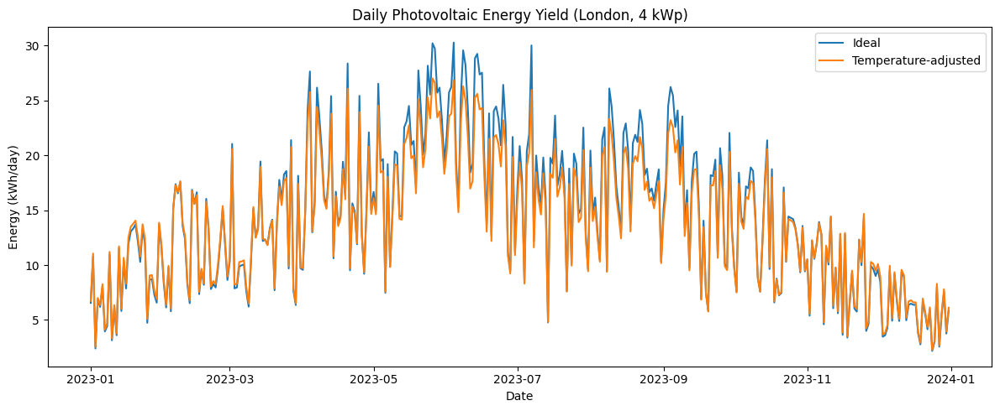
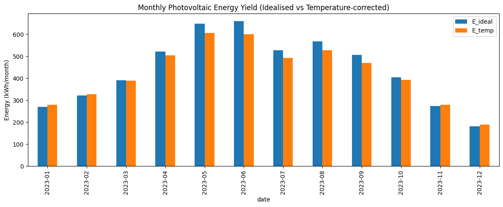

# Photovoltaics Yield Simulator

_A physics-inspired photovoltaic energy model_

## Overview

This project implements a **minimal, physics-based photovoltaic (PV) yield simulator** to estimate the daily and annual energy production of a silicon solar cell photovoltaic system.

Rather than relying on machine learning, the model is built directly from **first-principles equations** commonly used in solar engineering, with a particular focus on **quantifying temperature-related efficiency losses**.

The core question this project answers is:

> **How much energy yield do we overestimate if we ignore temperature effects in photovoltaic modelling?**

---

## Model Assumptions

To keep the model focused and interpretable, the following assumptions are made:

-   No shading or horizon obstruction
-   No inverter, wiring, or soiling losses
-   Fixed-tilt PV system
-   Isotropic diffuse irradiance model
-   Single representative temperature coefficient (typical crystalline silicon)

These simplifications allow temperature effects to be studied in isolation.

---

## Motivation

Many introductory photovoltaic models assume constant panel efficiency, which can lead to **systematic overestimation of energy yield**, particularly during warmer months.

This project compares:

-   A baseline **ideal photovoltaic model** (no losses)
-   A **temperature-adjusted photovoltaic model** incorporating cell temperature effects

By isolating temperature losses, the simulator highlights:

-   Daily yield differences
-   Seasonal trends
-   Annual energy loss due to temperature alone

---

## Results

For a fixed-tilt photovoltaic system in London (51.5°N) with a nominal capacity
of 4 kWp, the simulator produces daily, monthly, and annual energy yield
estimates under both ideal (25 °C reference) and temperature-adjusted
conditions.

Using daily meteorological data from NASA POWER for 2023, the model predicts:

-   **Ideal annual energy yield:** 5,278 kWh
-   **Temperature-adjusted annual energy yield:** 5,060 kWh
-   **Annual energy reduction due to temperature:** **218 kWh (-4.1%)**

Temperature effects exhibit strong seasonal behaviour. During winter months,
low ambient temperatures slightly increase photovoltaic efficiency relative to the
25 °C reference condition. In contrast, summer months experience elevated photovoltaic
cell temperatures, leading to reduced conversion efficiency and the majority
of annual energy losses.

Although winter efficiency gains are observed, summer losses dominate on an
annual basis, resulting in a net reduction in energy yield. These results
highlight the importance of accounting for thermal effects when estimating
realistic photovoltaic system performance.

Representative daily and monthly energy profiles are shown in the accompanying
`temperature_loss_analysis.ipynb` notebook, illustrating the seasonal concentration of temperature losses during
high-irradiance periods.





---

## Model Formulation

### 1. Solar Irradiance

Global Horizontal Irradiance (GHI) is converted to **plane-of-array (POA) irradiance** using a simplified transposition model that accounts for panel tilt and orientation:

`G_POA = H_b × R_b + H_d × (1 + cos(β)) / 2`

Where:

-   `H_b` and `H_d` are the beam and diffuse components of GHI
-   `R_b` is the geometric factor for beam radiation on a tilted surface
-   `β` is the panel tilt angle

---

### 2. Ideal PV Energy Model

The ideal energy yield assumes constant panel efficiency at reference conditions (25°C):

`E_ideal = G_POA × P_rated`

This serves as a **control model** against which losses are measured.

---

### 3. Temperature-Adjusted Model

Cell temperature is estimated using the NOCT (Nominal Operating Cell Temperature) model:

`T_cell = T_air + ((NOCT - 20) / 800) × G_POA`

A temperature correction factor is applied to account for efficiency changes:

`f_T = 1 + γ × (T_cell - 25)`

Where `γ` is the temperature coefficient (typically −0.004 /°C for crystalline silicon).

The temperature-adjusted energy yield is then:

`E_temp = E_ideal × f_T`

---

## Project Structure

```text
photovoltaics-yield-simulator/
├── solar_geometry.py
├── irradiance.py
├── pv_model.py
├── notebooks/
│   └── data_exploration.ipynb
│   └── temperature_loss_analysis.ipynb
├── data/
│   └── weather_london_2023.csv
│   └── weather_london_2023_cleaned.csv
├── assets/
│   └── daily-pv-energy-yield-comparison.png
│   └── monthly-pv-energy-yield-comparison.png
├── requirements.txt
└── README.md
```
---

## Conclusion

Under idealised, loss-free conditions using NASA POWER irradiance and an isotropic diffuse model, a 4 kWp fixed-tilt PV system in London would produce approximately 5.1–5.3 MWh/year, with temperature effects reducing yield by about 4% relative to a 25 °C reference. 

NASA POWER meteorological data were used to ensure global consistency and reproducibility. While POWER has been shown to slightly overestimate surface irradiance in cloudy maritime climates such as the UK, this bias primarily affects absolute energy yield estimates and does not materially alter the relative impact of temperature-related efficiency losses investigated in this study.
